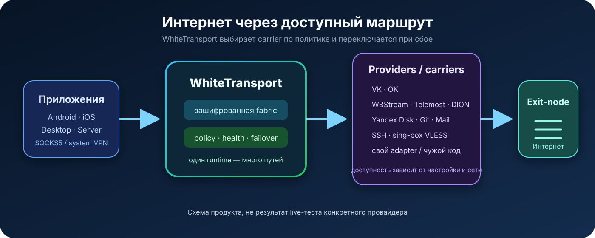

# WhiteTransport

[Загрузки](https://github.com/meanwebuser/whitetransport-public/releases) · [Исходный код](https://github.com/meanwebuser/whitetransport-public) · [Issues](https://github.com/meanwebuser/whitetransport-public/issues)



> **Интернет через любой доступный и настроенный provider/carrier-маршрут.**

WhiteTransport использует разрешённые вам сообщения, файлы, видеозвонки,
облака, SSH и обычные proxy-протоколы как взаимозаменяемые транспортные пути.
Клиент выбирает маршрут по политике, следит за его состоянием и может
переключиться на другой, не меняя приложение.

- Native Go runtime для Android, iOS, Desktop и exit-node.
- Локальный SOCKS5 и отдельный Browser/PWA-трек без SOCKS5.
- Общая encrypted fabric для discovery, control, stream, bulk и repair.
- Собственные adapters и совместимый чужой код можно подключать без создания
  отдельного протокольного острова.

> Public source никогда не содержит production credentials, операторскую
> топологию или готовые приватные TokenStore. Наличие кода не гарантирует, что
> конкретный provider доступен в вашей сети и с вашим аккаунтом.

## Как это работает

```text
Приложение
  → SOCKS5 / system VPN
  → WhiteTransport policy + encrypted fabric
  → доступный carrier (VK / OK / WBStream / Telemost / DION / SSH / ...)
  → exit-node
  → интернет
```

Provider — интеграция с внешней платформой. Carrier — конкретный путь через
неё. Один provider может дать несколько carriers: например, сообщения,
документы и видеозвонок VK.

## Какие маршруты уже представлены в runtime

Это inventory исходного кода, а не обещание live-доступности.

| Provider / carrier | Назначение | Runtime |
|---|---|---|
| `vk.messages` | discovery, control, небольшой egress | native |
| `vk.docs.256`, `vk.docs.1024` | bulk, repair, крупные chunks | native |
| `ok.messages` | discovery, control, небольшой egress | native |
| `ok.docs.256` | bulk и repair | native |
| `wbstream`, `wbstream.vp8` | realtime DataChannel/VP8 egress | provider bridge |
| `telemost` | видеопоток как DataTunnel | provider bridge |
| `dion`, `dion.call` | видеопоток как DataTunnel | provider bridge |
| `vkcall` | VK Call DataChannel/VP8 | provider bridge |
| `yandex.disk.files` | долговечный file mailbox, bulk, repair | native |
| `git.repository` | append-only Git mailbox | native |
| `mail.imap_smtp` | SMTP отправка + IMAP polling | native |
| `ssh.tcp` | TCP egress через SSH | native |
| `ssh.fabric` | control + egress в pinned SSH session | native |
| `singbox.vless` | egress через VLESS/Xray/sing-box | native |
| `file.mailbox`, `memory.provider` | локальные deterministic tests | local fixture |

Desktop/server registry содержит `vk`, `ok`, `wbstream`, `telemost`, `dion` и
`vkcall`. Mobile registry сейчас содержит `vk`, `ok`, `wbstream` и `vkcall`.
Для каждого внешнего маршрута нужен отдельный proof в реальной сети: сначала
sender→provider→receiver, затем payload через SOCKS и exit-node.

## Что готовится

В canonical inventory зарезервированы, но ещё не должны называться рабочими Go
carriers:

- VK/OK Photos и VK Browser Bridge;
- Telegram Messages;
- будущие VK/Telemost audio, DataChannel и dual-stream варианты;
- audio/FSK;
- Mail.ru Cloud и Sber Cloud;
- live-proof и production hardening для маршрутов, где пока есть только код,
  локальный test или catalog profile.

## Автобенчмарк: latency, speed и примерный максимум в сутки

Безопасная команда читает canonical Go inventory и не обращается к провайдерам:

```bash
cd core/go
/usr/local/go/bin/go run ./cmd/carrier-benchmark
```

JSON содержит все текущие, local-fixture и planned строки. Неизвестные метрики
остаются `null`. Цифры ниже — модель по catalog constants, а не live API/SOCKS
замер. Суточная ёмкость — верхняя экстраполяция постоянной скорости либо
заданный `DailyBytes`; реальные rate limits, квоты и сеть могут дать намного
меньше.

| Carrier | Модель latency | Модель throughput | Примерный верх за 24 часа |
|---|---:|---:|---:|
| VK Messages | 200 мс | 12 KiB/s | 0,93 GiB |
| OK Messages | 250 мс | 10 KiB/s | 0,79 GiB |
| VK Docs 256 | нет данных | 576 KiB/s | 45,63 GiB |
| VK Docs 1024 | нет данных | 8,98 MiB/s | 743,20 GiB |
| OK Docs 256 | нет данных | 480 KiB/s | 37,25 GiB |
| WBStream VP8 | нет данных | 7,63 MiB/s | 643,61 GiB |
| Yandex Disk | 3000 мс | 350 KiB/s | 46,57 GiB |
| Mail IMAP/SMTP | 2000 мс | 16 KiB/s | 1,32 GiB |
| SSH TCP / Fabric | 150 мс | 2,00 MiB/s | 168,75 GiB |
| sing-box VLESS | 80 мс | 16,00 MiB/s | 1350,00 GiB |

Для Telemost, DION, VK Call и других registry-only providers сопоставимых
catalog metrics пока нет: честный ответ autobenchmark — `null`.

## Скачать

Текущий публичный Linux x64 bundle:

```bash
curl -fL -o whitetransport-linux-x64.tar.gz \
  https://github.com/meanwebuser/whitetransport-public/releases/download/v0.4.269-public.1/whitetransport-0.4.269-public.1-linux-x64-provisioning-only.tar.gz
```

Это **provisioning-only** сборка: добавьте собственную разрешённую
конфигурацию и credentials. Единой установки для всех платформ пока нет; мы не
называем `git clone && build` пользовательским installer.

## Что видно в продукте

Ниже настоящие captures текущих приложений с disposable demo data, без
production endpoints и credentials.

### Control console


### Android client


Клиент намеренно показан disconnected: screenshot не должен притворяться
доказательством активного production route.

## Как добавить свой или чужой carrier

1. Внешняя платформа: реализуйте тонкий `provider.Provider` adapter и
   зарегистрируйте его в runtime registry.
2. Самостоятельный транспорт: реализуйте `carriers.Carrier`, typed config и
   binding.
3. Добавьте capability inventory и deterministic local test.
4. Затем проведите отдельный live-provider и SOCKS/exit-node canary.
5. Чужой код можно импортировать или оборачивать при совместимой лицензии.
   Сохраняйте авторство, LICENSE/NOTICE и по возможности отправляйте общие
   исправления upstream.

## Благодарности

WhiteTransport вдохновлён проектом
[kulikov0/whitelist-bypass](https://github.com/kulikov0/whitelist-bypass),
который показал практический туннель через WebRTC-видеоплатформы. Его исходный
код и наш fork легли в основу части headless WebRTC, DataChannel/VP8 tunnel и
provider adapters WhiteTransport. Исходное авторство, MIT-лицензия и
уведомления компонентов сохраняются.

Также благодарим LiveKit, Pion, sing-box, Xray, Scramjet и другие open-source
проекты, на которых строится этот стек.

## Безопасность и лицензия

Используйте только сервисы и аккаунты, на которые у вас есть разрешение, и
соблюдайте правила платформ. WhiteTransport не гарантирует доступность любого
provider, обход любой блокировки или catalog speed в реальной сети.

Верхнеуровневый source распространяется по [MIT License](LICENSE). Browser/PWA
в `apps/web` имеет отдельную AGPL-3.0-only лицензию — см. notices в этом каталоге.
