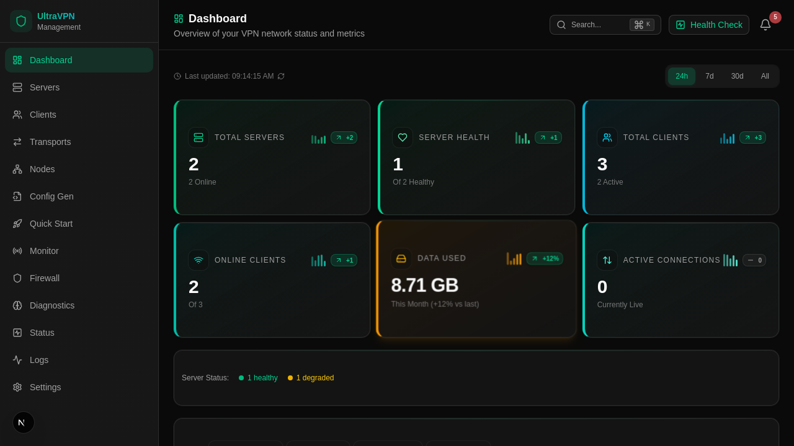
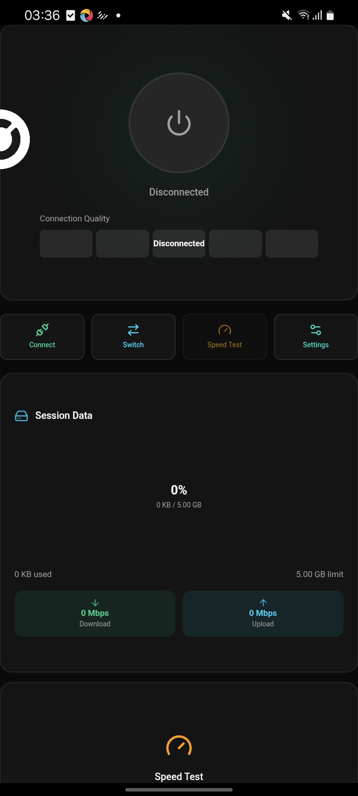

# WhiteTransport

**Private connectivity that adapts instead of giving up.**

WhiteTransport is an adaptive connectivity fabric for people and teams who
need a connection that can choose the best available path, recover when a path
degrades, and keep the experience simple: open the client, choose automatic
mode, connect.

It is designed as a product platform rather than a single-protocol tunnel:
the native runtime can negotiate between multiple carrier types, observe
health, and route traffic classes through the path that makes sense at that
moment. The same foundation serves a desktop client, a mobile client, and a
team control console.

> **Public source release.** This repository contains safe, reviewable source
> code and product previews. It never contains production credentials,
> operator topology, customer data, or credential-bearing bundles.

## A calmer way to stay connected

| For an individual | For a team |
| --- | --- |
| One clear protected state instead of transport jargon | Visibility into route health, sessions and policy |
| Automatic route selection with explicit diagnostics | A native runtime shared across desktop, mobile and nodes |
| A local SOCKS5 endpoint for compatible apps | Extensible carrier fabric instead of a single point of failure |

## The product, as it runs today

### Control console

This is a real capture of the current `apps/admin` dashboard, run against an
isolated SQLite database. It shows the actual navigation, metrics cards and
health surface; the values are disposable demo data and no production endpoint
or credential is present.

### Android client

This is a real device capture of the current Android client. It is intentionally
shown in its disconnected state rather than pretending a production route is
active.

The native desktop client is implemented in `apps/native-gui` and verified by a
real Wails launch/payload lane. A public desktop screenshot will be added only
after it can be captured without leaking node, route or local-runtime details.

## What is available in this source release

- `core/go` — the native runtime, session engine, carrier fabric and local
  SOCKS5 service;
- `apps/native-gui` — the Wails desktop client direction;
- `apps/android` and `apps/ios` — native mobile client integrations;
- `apps/web` and `packages/browser-transport` — a separate browser/PWA track;
- `packages` — reusable transport contracts and provider-channel libraries.

## For developers and integrators

Clone the repository to inspect the architecture and run the source-level test
lanes before connecting any real provider. Bring your own provisioning and
credentials: public source intentionally ships without them. Deployment status,
operator topology and production configuration intentionally remain private.

## License

The top-level source is [MIT](LICENSE). The Browser/PWA application in
`apps/web` is separately licensed under AGPL-3.0-only; see that directory for
its license and notices.
