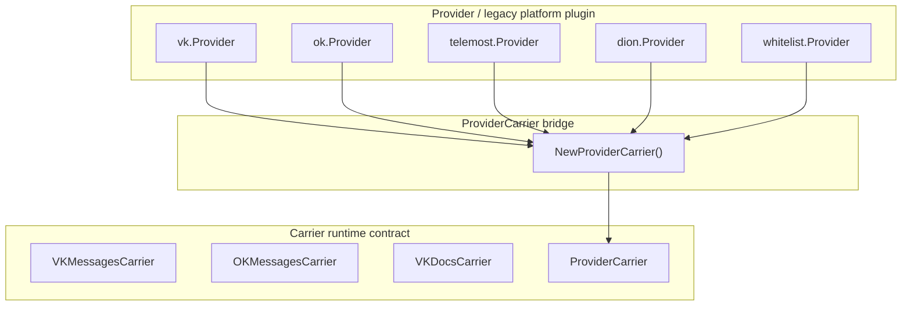

# Архитектурное видение WhiteTransport

> Этот документ описывает целевую архитектуру WhiteTransport, текущее состояние системы
> и направление дальнейшего развития. Разделы помечены статусами:
> **[Реализовано]**, **[В разработке]**, **[Цель]**, **[Legacy]**.

---

## 1. Цель **[Цель]**

WhiteTransport — это пользовательский VPN-продукт, в котором клиент устанавливает
одно приложение, нажимает «Подключить», а рантайм сам выбирает работающий
транспортный маршрут.

Пользователь не должен знать, используется ли внутри VK, OK, WBStream, Telemost,
DION, Yandex или другой backend. Для пользователя это один продукт и одно
соединение.

Ключевые принципы:

* **Единый UX** — одно приложение, одна кнопка подключения, один runtime.
* **Много платформ** — VK, OK, WB, Yandex, DION и будущие платформы используются
  как взаимозаменяемые backend-площадки.
* **Много способов передачи** — сообщения в чате, документы, картинки, видео,
  WebRTC/DataChannel и другие методы передачи байтов.
* **Автоматический failover** — Policy Engine оценивает доступность, скорость,
  надёжность, задержку и стоимость маршрутов.
* **Carrier-only datapath** — передача данных должна идти через `Carrier`, а не
  через платформенный `Provider`.
* **Endpoint-aware routing** — каждый вызов отправки должен знать конкретный
  endpoint: `peer_id`, `chat_id`, `room`, `call_id` или другой адрес назначения.

---

## 2. Базовая модель **[Цель]**

Архитектура WhiteTransport строится вокруг пяти независимых понятий:

```text
Platform  = внешняя платформа
Channel   = логическая роль или lane внутри платформы
Transport = способ передачи байтов
Binding   = конкретная связка platform + channel + transport + endpoint
Carrier   = runtime-реализация передачи данных
```

### 2.1 Platform

`Platform` — это внешний сервис или экосистема, через которую можно передавать
данные.

Примеры:

```text
vk
ok
wb
yandex
dion
```

Платформа отвечает за общие вещи:

* авторизация: token, cookies, session;
* API client;
* rate limits;
* health check;
* создание и сопровождение сессий, если это нужно платформе.

Платформа сама по себе не является datapath. Она предоставляет инфраструктуру,
которую используют конкретные carrier-ы.

---

### 2.2 Channel

`Channel` — это логический канал, lane или роль.

Примеры ролей:

```text
discovery
node-client
logs
admin
```

Примеры физических endpoint-ов:

```text
VK peer_id
OK chat_id
Yandex Telemost room
DION room
WB call/session id
```

Важно: канал — это не способ передачи. Один и тот же VK `peer_id` может
использоваться разными transport-ами: сообщениями, документами или картинками.

---

### 2.3 Transport / Method

`Transport` — это способ упаковки и передачи байтов.

Примеры:

```text
messages
docs
images
photos
video.vp8
video.datachannel
```

Примеры полных transport-ов:

```text
vk.messages
vk.docs
vk.photos
ok.messages
ok.docs
ok.photos
wb.wbstream
yandex.telemost
dion.video
```

Transport описывает, каким механизмом байты будут доставлены, но не определяет
конкретный endpoint. Endpoint задаётся на уровне binding.

---

### 2.4 Binding

`Binding` — это конкретный runtime-маршрут.

Он связывает:

```text
platform + transport + role/channel + endpoint + carrier instance
```

Примеры binding key:

```text
vk.messages:discovery
vk.messages:node-client
vk.messages:logs
vk.messages:admin

vk.docs:bulk
ok.messages:discovery

wb.wbstream:node-client
yandex.telemost:node-client
dion.video:node-client
```

Один `Carrier` может иметь несколько bindings, если он stateless и отличается
только endpoint-ом. Например, один `VKMessagesCarrier` может обслуживать несколько
VK peer_id:

```text
vk.messages:discovery   → peer_id_1
vk.messages:node-client → peer_id_2
vk.messages:logs        → peer_id_3
vk.messages:admin       → peer_id_4
```

---

### 2.5 Carrier

`Carrier` — это runtime-объект, который реально передаёт и принимает байты.

Целевой контракт:

```go
type Carrier interface {
    Descriptor() CarrierDescriptor

    Write(ctx context.Context, endpoint Endpoint, payload []byte) error
    Read(ctx context.Context, endpoint Endpoint) ([]byte, error)

    Probe(ctx context.Context, endpoint Endpoint) ProbeResult
}
```

Ключевое требование: `endpoint` должен быть параметром вызова.

Нельзя, чтобы carrier или provider жёстко зашивал `peer_id`, `chat_id` или room
внутри себя и игнорировал per-call routing.

---

## 3. PlatformClient вместо Provider **[Цель]**

Текущий `Provider` смешивает две разные роли:

1. platform/control-plane plugin;
2. datapath sender/receiver.

В целевой архитектуре эти роли разделяются.

### 3.1 PlatformClient

Для каждой платформы может существовать общий client:

```text
VKPlatformClient
OKPlatformClient
YandexPlatformClient
WBPlatformClient
DIONPlatformClient
```

Он отвечает за:

* auth;
* API calls;
* cookies/session;
* создание комнат или звонков;
* platform-specific health;
* rate limits;
* вспомогательные операции.

### 3.2 Carrier

Carrier использует `PlatformClient`, но именно Carrier остаётся datapath-контрактом.

Пример:

```text
VKPlatformClient
 ├── VKMessagesCarrier
 ├── VKDocsCarrier
 └── VKPhotosCarrier

OKPlatformClient
 ├── OKMessagesCarrier
 ├── OKDocsCarrier
 └── OKPhotosCarrier

YandexPlatformClient
 └── TelemostVideoCarrier

WBPlatformClient
 └── WBStreamCarrier

DIONPlatformClient
 └── DIONVideoCarrier
```

### 3.3 Что делать с Provider

`Provider` в текущем виде считается **legacy abstraction**.

Цель не в том, чтобы сразу удалить весь Provider-код. Цель — убрать Provider из
пути передачи данных.

Правильное направление:

```text
Provider / PlatformAdapter = factory, config, lifecycle, health
Carrier                    = datapath
Binding                    = конкретный runtime route
```

Неправильное направление:

```text
Provider.Send(ctx, []byte)
```

Проблема такого подхода в том, что `Provider.Send()` теряет endpoint и не может
корректно маршрутизировать сообщения по разным каналам.

---

## 4. Текущее состояние **[Реализовано]**

### 4.1 Go Runtime

Ядро системы — Go-демон `whitetransportd`, работающий в режимах:

```text
client
node
admin
```

| Компонент            | Каталог                                 | Назначение                                                      |
| -------------------- | --------------------------------------- | --------------------------------------------------------------- |
| **Fabric**           | `internal/fabric`                       | Зашифрованные конверты, чанки, классы трафика                   |
| **Carriers**         | `internal/carriers`                     | Интерфейс `Carrier` и реализации VK/OK/File/ProviderCarrier     |
| **Provider**         | `internal/provider`                     | Legacy-интерфейс платформенного plugin-а                        |
| **Adapters**         | `internal/adapters/<name>/`             | Provider-адаптеры для vk, ok, telemost, dion, whitelist, memory |
| **ProviderCarrier**  | `internal/carriers/provider_carrier.go` | Legacy-мост Provider → Carrier                                  |
| **ProviderRegistry** | `internal/runtime/adapters.go`          | Registry/factory для Provider-адаптеров                         |
| **Policy**           | `internal/policy`                       | Скоринг, scheduling, dispatch, multi-path delivery              |
| **Session**          | `internal/session`                      | Node advertise, offer/answer, failover state machine            |
| **Proxy**            | `internal/proxy`                        | Локальный SOCKS5/HTTP CONNECT egress proxy                      |
| **Config**           | `internal/config`                       | Типизированная загрузка конфигурации                            |
| **Runtime**          | `internal/runtime`                      | Control plane, bindings, dispatch                               |

---

## 5. Legacy Provider/Carrier bridge **[Legacy]**

Исторически система использовала трёхслойную модель:



Эта модель больше не должна расширяться для native carriers.

Проблемы legacy-модели:

1. Для VK/OK native carriers слой Provider не добавляет ценности.
2. Возникает циклическая обёртка: native carrier → provider → provider-carrier.
3. `Provider.Send(ctx, []byte)` не принимает endpoint.
4. Каналы вроде `discovery`, `node-client`, `logs`, `admin` невозможно выразить
   корректно без per-binding endpoint-а.
5. Binding layer должен выбирать конкретный route, а не абстрактный provider.

---

## 6. Целевая runtime-схема **[Цель]**

Целевой datapath:

```text
Policy Engine
    ↓
Scheduler
    ↓
Binding key
    ↓
CarrierBinding
    ↓
Carrier.Write(ctx, endpoint, payload)
    ↓
Platform API / Video tunnel / DataChannel
```

Policy и scheduler не должны отправлять данные в platform/provider напрямую.
Они выбирают binding.

Пример:

```text
TrafficBootstrap → vk.messages:discovery
TrafficControl   → vk.messages:node-client
TrafficLog       → vk.messages:logs
TrafficAdmin     → vk.messages:admin
Bulk             → vk.docs:bulk
Egress           → wb.wbstream:node-client
```

---

## 7. Channel-aware bindings **[В разработке]**

`VKChannelConfig` уже описывает несколько каналов на одну платформу:

```text
discovery
node-client
logs
admin
```

Целевое поведение binding layer:

```text
vk.messages:discovery
vk.messages:node-client
vk.messages:logs
vk.messages:admin
```

Все эти bindings могут использовать один общий `VKMessagesCarrier`, но разные
endpoint-ы:

```text
vk.messages:discovery   → peer_id_1
vk.messages:node-client → peer_id_2
vk.messages:logs        → peer_id_3
vk.messages:admin       → peer_id_4
```

Если channels не заданы, должна сохраняться обратная совместимость:

```text
vk.messages → single peer_id
```

---

## 8. Policy, scheduling и dispatch **[Реализовано / В разработке]**

Policy Engine поддерживает несколько стратегий доставки.

| Стратегия  | Применение        | Описание                                          |
| ---------- | ----------------- | ------------------------------------------------- |
| `single`   | Egress/stream     | Один binding, один маршрут                        |
| `striped`  | Bulk/repair       | Чанки распределяются по нескольким bindings       |
| `mirrored` | Bootstrap/control | Дублирование через несколько независимых bindings |
| `hedged`   | Admin/health/log  | Отложенное дублирование после timeout-а           |

Целевой контракт:

```text
SchedulePayload()
    ↓
DispatchScheduledPayload()
    ↓
DeliveryTracker
    ↓
ACK / repair / retry
```

Важное изменение: scheduler должен оперировать не только `carrierID`, но и
`binding key`.

Причина: несколько bindings могут использовать один и тот же carrier descriptor,
но разные endpoint-ы.

Пример:

```text
vk.messages:discovery
vk.messages:node-client
vk.messages:logs
```

Все три binding-а могут иметь один descriptor `vk.messages`, но это разные
runtime-маршруты.

---
## Carrier capabilities и выбор оптимального маршрута **[Цель]**

WhiteTransport должен поддерживать не только видеозвонки и сообщения, но и любые
платформенные механизмы, через которые можно обмениваться байтами.

Примеры будущих и текущих transport-ов:

```text id="yzrvzt"
vk.messages
vk.docs
vk.photos
ok.messages
ok.docs
ok.photos

wb.wbstream
yandex.telemost
dion.video

yandex.disk.files
yandex.zen.posts
sber.s3.objects
filesystem.mailbox
generic.s3.objects
generic.http.posts
```

То есть carrier может быть не только realtime-туннелем, но и mailbox,
object storage, файловым хранилищем, постами, документами или сообщениями.

Главное требование: каждый carrier должен явно описывать свои возможности,
ограничения и runtime-характеристики, чтобы Policy Engine мог сам выбрать
оптимальный способ доставки.

---

### Carrier capabilities

Каждый carrier должен публиковать capability descriptor.

Примерная модель:

```go id="onm6sl"
type CarrierCapabilities struct {
    // Базовые свойства
    Realtime        bool // подходит для низкой задержки / stream
    Streaming       bool // можно ли держать долгую сессию
    Mailbox         bool // можно ли использовать как асинхронный mailbox
    ObjectStorage   bool // работает ли как файловое/object storage хранилище

    // История и чтение
    CanReadPast     bool // можно ли читать старые сообщения/объекты
    CanList         bool // можно ли перечислять прошлые объекты
    CanPoll         bool // можно ли периодически опрашивать
    CanSubscribe    bool // есть ли push/event-подписка

    // Мутации
    CanEdit         bool // можно ли менять уже отправленное сообщение/объект
    CanDelete       bool // можно ли удалить отправленное
    CanOverwrite    bool // можно ли перезаписать объект с тем же ключом
    AppendOnly      bool // канал только append-only

    // Производительность
    MaxPayloadBytes int
    ExpectedLatency string // low / medium / high
    ExpectedThroughput string // low / medium / high
    CostClass       string // cheap / normal / expensive

    // Надёжность
    Durable         bool // данные сохраняются после отправки
    Ephemeral       bool // данные исчезают после завершения сессии
    Ordered         bool // сохраняется ли порядок доставки
    IdempotentWrite bool // можно ли безопасно повторять write

    // Назначение
    TrafficClasses  []TrafficClass
    Roles           []string // discovery, control, admin, logs, bulk, egress
}
```

Эти свойства нужны не только для документации. Они должны напрямую влиять на
выбор маршрута.

---

### Примеры свойств разных carrier-ов

| Carrier              | Тип                   |         Latency |       Throughput | История | Edit/Delete               | Назначение                    |
| -------------------- | --------------------- | --------------: | ---------------: | ------- | ------------------------- | ----------------------------- |
| `wb.wbstream`        | realtime video tunnel |          низкая |          высокая | нет     | нет                       | egress, stream                |
| `dion.video`         | realtime video tunnel |  низкая/средняя |          высокая | нет     | нет                       | egress fallback               |
| `yandex.telemost`    | realtime video tunnel |  низкая/средняя |          высокая | нет     | нет                       | egress fallback               |
| `vk.messages`        | chat mailbox          |         средняя |           низкая | да      | edit/delete частично      | discovery, control, logs      |
| `ok.messages`        | chat mailbox          |         средняя |           низкая | да      | зависит от API            | mirrored control              |
| `vk.docs`            | document mailbox      |         высокая |  средняя/высокая | да      | delete возможно, edit нет | bulk, repair, fallback egress |
| `yandex.disk.files`  | file storage          |         высокая |  средняя/высокая | да      | overwrite/delete возможно | bulk, repair, slow tunnel     |
| `sber.s3.objects`    | object storage        |         высокая |          высокая | да      | overwrite/delete возможно | bulk, durable mailbox         |
| `yandex.zen.posts`   | post-based mailbox    |         высокая |   низкая/средняя | да      | зависит от токена/API     | emergency fallback            |
| `filesystem.mailbox` | local/file mailbox    | низкая локально | высокая локально | да      | да                        | tests, local control          |

---

## Policy Engine должен выбирать не provider, а лучший binding **[Цель]**

Policy Engine не должен иметь ручных ветвлений вида:

```text id="2duvgk"
если WB работает — использовать WB
если WB не работает — использовать DION
если DION не работает — использовать VK Docs
```

Вместо этого каждый binding публикует capabilities и runtime-метрики:

```text id="ftt979"
availability
latency
throughput
error_rate
recent_success
cost
supports_realtime
supports_history
supports_role
supports_traffic_class
```

Планировщик выбирает маршрут автоматически.

Пример желаемой логики для egress/internet-трафика:

```text id="4dtbgt"
1. Пробуем быстрый realtime carrier:
   wb.wbstream

2. Если WBStream недоступен или деградировал:
   пробуем dion.video

3. Если DION недоступен или VP8/DataChannel не работает:
   пробуем yandex.telemost

4. Если realtime-туннели недоступны:
   переходим на более медленные file/object carriers:
   vk.docs
   yandex.disk.files
   sber.s3.objects
   ok.docs

5. Если ничего быстрого не работает:
   используем самые медленные mailbox/post carriers:
   vk.messages
   ok.messages
   yandex.zen.posts
```

Важно: `vk.docs` может давать неплохую пропускную способность, но большую
задержку. Поэтому он подходит как fallback для bulk/egress, но плохо подходит
для интерактивного realtime-трафика.

---

## Разные пути трафика имеют разные требования **[Цель]**

В системе есть несколько важных traffic paths:

```text id="qy74bb"
discovery
control
admin
logs
health
bulk
repair
egress
```

Они не должны использовать один и тот же carrier одинаково.

### Discovery

Discovery должен быть максимально надёжным и durable.

Требования:

```text id="dslh89"
CanReadPast = true
Mailbox = true
Durable = true
CanPoll или CanSubscribe = true
```

Подходящие carrier-ы:

```text id="0snt5c"
vk.messages:discovery
ok.messages:discovery
yandex.disk.files:discovery
sber.s3.objects:discovery
filesystem.mailbox:discovery
```

Realtime-видеозвонки плохо подходят для discovery, потому что прошлое там
прочитать нельзя.

---

### Control

Control traffic — это `session.offer`, `session.answer`, команды и ответы.

Требования:

```text id="geb2a1"
надёжность
умеренная задержка
возможность читать прошлые сообщения
желательно delete/cleanup
```

Подходящие carrier-ы:

```text id="d8po17"
vk.messages:node-client
ok.messages:node-client
vk.docs:control
yandex.disk.files:control
```

Для control можно использовать mirrored delivery: например VK + OK одновременно.

---

### Admin

Admin traffic должен быть надёжным, auditable и желательно durable.

Подходящие carrier-ы:

```text id="7f3ddh"
vk.messages:admin
ok.messages:admin
sber.s3.objects:admin
yandex.disk.files:admin
```

---

### Logs

Logs могут быть более медленными, но должны быть durable и дешёвыми.

Подходящие carrier-ы:

```text id="dstu63"
vk.messages:logs
ok.messages:logs
yandex.disk.files:logs
sber.s3.objects:logs
filesystem.mailbox:logs
```

Для logs важна возможность читать историю. Возможность edit обычно не нужна.

---

### Egress

Egress — это интернет-трафик пользователя через SOCKS5/HTTP CONNECT. Он не
должен быть привязан только к realtime/stream carrier-ам.

Правильная модель: локальный proxy превращает TCP/HTTP работу в typed
operations (`open-stream`, `stream-data`, `dns-resolve`, `ack`, `close-stream`),
а runtime упаковывает эти операции в encrypted bundles. Дальше bundles могут
идти через любой carrier, который подходит по latency, throughput, payload size,
budget и deadline.

Требования:

```text id="re10vr"
быстро открыть первое соединение
удерживать interactive поток на low-latency carrier-е
параллельно дренировать bulk/large-response chunks через high-throughput carriers
использовать даже медленные durable carriers для repair, retry и emergency path
соблюдать дневные byte budgets и per-carrier rate limits
```

Пример роли carrier-ов в одном egress-сеансе:

```text id="nlu8lf"
wb.wbstream / dion.video / yandex.telemost:
  low-latency open-stream, interactive reads/writes, small urgent chunks

vk.docs / ok.docs / yandex.disk.files / sber.s3.objects:
  large response chunks, repair, retry, background drain, cache prefetch

vk.messages / ok.messages / audio:
  control, ACK, emergency slow path, small diagnostic or keepalive traffic
```

То есть “самый быстрый” carrier должен как можно быстрее дать пользователю
рабочий интернет, но самый медленный carrier тоже не должен простаивать, если у
него есть оставшийся budget и задача допускает задержку.

---

## История, мутации и append-only каналы **[Цель]**

Carrier-ы сильно отличаются по тому, можно ли читать и менять прошлые данные.

Примеры:

```text id="xbfgt0"
Видеозвонок:
  CanReadPast = false
  CanEdit = false
  CanDelete = false
  Ephemeral = true

VK messages:
  CanReadPast = true
  CanEdit = true/частично
  CanDelete = true/частично
  Durable = true

VK posts с group token:
  CanReadPast = true
  CanEdit = false или ограниченно
  CanDelete = ограниченно
  AppendOnly = часто true

VK docs:
  CanReadPast = true
  CanEdit = false
  CanDelete = true/частично
  Durable = true

Yandex Disk / S3:
  CanReadPast = true
  CanList = true
  CanOverwrite = true
  CanDelete = true
  Durable = true

Filesystem:
  CanReadPast = true
  CanList = true
  CanOverwrite = true
  CanDelete = true
  Durable = зависит от backend-а
```

Эти различия должны учитываться автоматически.

Например:

* если нужно обновить состояние node presence, лучше использовать carrier с
  `CanOverwrite` или `CanEdit`;
* если канал append-only, нужно писать новые записи и использовать TTL/cleanup;
* если carrier не умеет читать прошлое, он не подходит для discovery;
* если carrier ephemeral, он подходит для stream, но не для durable control;
* если carrier high-latency, он не должен быть первым выбором для egress.

---

## Итоговое правило выбора carrier-а **[Цель]**

WhiteTransport должен выбирать маршрут по задаче, а не по названию платформы.

Неправильно:

```text id="5dpujq"
использовать VK
использовать WB
использовать Yandex
```

Правильно:

```text id="x54g6h"
для discovery выбрать durable mailbox с history
для control выбрать надёжный low/medium-latency mailbox
для logs выбрать дешёвый durable append-only storage
для interactive egress выбрать low-latency carrier
для bulk egress дренировать chunks через все подходящие high-throughput carriers
для fallback/repair использовать даже медленные durable carriers, если deadline позволяет
```

Финальная цель:

```text id="bltji9"
Пользователь нажимает «Подключить».
Runtime сам пробует доступные bindings.
Policy Engine измеряет latency/throughput/error_rate.
Scheduler выбирает лучший маршрут.
При деградации происходит failover по speed / quata trafic per day remains:
WBStream / DION / Telemost / SSH → VK Docs / Yandex Disk / S3 → Messages / Posts.
```

Даже если быстрый realtime carrier недоступен, система должна продолжать работать
через более медленные, но durable carrier-ы. Скорость может снизиться, задержка
может вырасти, но соединение не должно полностью ломаться, пока есть хоть один
доступный путь обмена данными.

## 9. Data plane carriers **[Реализовано / В разработке]**

### 9.1 Native carriers

Native carriers — это carrier-ы, которые напрямую работают с API платформы.

Примеры:

```text
vk.messages
vk.docs
vk.photos
ok.messages
ok.docs
ok.photos
file.mailbox
```

Для них Provider layer не нужен. Они должны создаваться напрямую в binding layer
и использовать platform client/token store.

---

### 9.2 Video carriers

Video carriers используют видеозвонки, WebRTC, VP8 tunnel или DataChannel-like
механизм.

Примеры:

```text
wb.wbstream
yandex.telemost
dion.video
```

Для них нужен lifecycle:

* создать комнату/звонок;
* войти в сессию;
* поднять media/data tunnel;
* проверить health;
* корректно остановить session.

Но lifecycle не должен означать возврат к `Provider.Send()`.

Целевая модель:

```go
type LifecycleCarrier interface {
    Carrier

    Start(ctx context.Context, endpoint Endpoint) error
    Stop(ctx context.Context, endpoint Endpoint) error
    Health(ctx context.Context) HealthStatus
}
```

То есть video carrier остаётся carrier-ом, просто с дополнительным lifecycle.

---

## 10. SOCKS5 egress **[Реализовано]**

Клиентский интернет-трафик проходит через локальный SOCKS5/HTTP CONNECT proxy.

Схема:

```text
Client application
    ↓
SOCKS5 / HTTP CONNECT
    ↓
DataTunnelEgress
    ↓
Carrier tunnel
    ↓
WBStream / Telemost / DION / other carrier
    ↓
Exit node
    ↓
Optional upstream proxy
    ↓
Internet
```

Upstream proxy применяется только к egress-трафику, если явно включён:

```text
auto_egress: true
```

Контрольный трафик не должен идти через upstream proxy:

```text
bootstrap
control
admin
logs
health
```

---

## 11. Discovery bus **[Цель]**

Discovery bus — это логическая шина обнаружения и управления поверх нескольких
carrier-ов.

Высокоуровневый код публикует типизированные зашифрованные сообщения:

```text
node.advertise
node.withdraw
session.offer
session.answer
room.announce
room.claim
room.release
command.request
command.result
health.report
client.log
```

Приложение не должно ветвиться по конкретным backend-ам:

```text
vktextprovider
oktextprovider
```

Вместо этого оно должно выбирать binding по capability и role:

```text
TrafficBootstrap → bindings with role discovery
TrafficControl   → bindings with role node-client
TrafficLog       → bindings with role logs
TrafficAdmin     → bindings with role admin
```

---

## 12. VK / OK lane pools **[Цель]**

Масштабирование message bus достигается не созданием новых Provider-ов, а
добавлением нескольких каналов/lane внутри одной платформы.

Пример:

```dotenv
VK_DISCOVERY_PEER_IDS=2000000001,2000000002
VK_CONTROL_PEER_IDS=2000000003,2000000004
VK_LOG_PEER_IDS=2000000005,2000000006
VK_ADMIN_PEER_IDS=2000000007
```

Человеческие имена вроде `c1log` или `c2log` могут использоваться в конфиге как
метки, но runtime должен работать с настоящими platform endpoint-ами:

```text
VK peer_id
OK chat_id
```

---

## 13. Session flow **[Реализовано / В разработке]**

Базовый session flow:

1. Node стартует.
2. Node публикует `node.advertise` через bootstrap bindings.
3. Client читает bootstrap bindings и находит доступный node.
4. Client отправляет `session.offer` через control binding.
5. Node получает offer.
6. Node публикует `node.withdraw`, чтобы временно убрать себя из discovery.
7. Node создаёт transport session: WBStream, Telemost, DION или другой carrier.
8. Node отправляет `session.answer`.
9. Client подключается к transport session из answer.
10. Egress-трафик идёт через SOCKS5 → DataTunnelEgress → carrier tunnel → node → internet.
11. После завершения сессии node снова публикует `node.advertise`.

---

## 14. Browser/PWA track **[В разработке]**

Browser/PWA — отдельный runtime-трек для чистого браузера:

```text
iPhone Safari
PWA
Chrome
desktop browser
```

Он не должен наследовать предположения Go Runtime.

|                   | Go Runtime                           | Browser / PWA                            |
| ----------------- | ------------------------------------ | ---------------------------------------- |
| Каталог           | `core/go/`                           | `apps/web`, `packages/browser-transport` |
| Локальный proxy   | SOCKS5 / HTTP CONNECT                | Нет                                      |
| Основной tunnel   | Carrier tunnel                       | Scramjet / Wisp / WebRTC                 |
| Transport backend | VK / OK / WBStream / Telemost / DION | WebRTC / browser-compatible backend      |
| Runtime language  | Go                                   | TypeScript                               |

Правило:

```text
Go Runtime использует SOCKS5.
Browser/PWA использует browser-compatible transport.
Общие TypeScript-пакеты — это контракты, а не общий runtime.
```

---

## 15. Система секретов **[Реализовано]**

Канонический формат секретов — TokenStore JSON.

Целевой pipeline:

```text
secrets/production/*.json
    ↓
generate-token-store.sh
    ↓
token-store.json
    ↓
config
    ↓
whitetransportd
```

Env vars могут использоваться только как runtime override или для systemd/deploy
обвязки, но не должны быть главным источником истины для токенов.

---

## 16. Структура каталогов **[Цель]**

Целевая структура должна постепенно отделить platform clients, carriers и legacy
provider adapters.

```text
core/go/
├── cmd/
│   └── whitetransportd/
└── internal/
    ├── fabric/                 # Зашифрованные конверты, чанки, классы трафика
    ├── carriers/               # Carrier-интерфейс и datapath-реализации
    ├── platforms/              # Platform clients: vk, ok, yandex, wb, dion
    ├── config/                 # Типизированная загрузка конфигурации
    ├── policy/                 # Скоринг, routing, scheduling, multi-path delivery
    ├── proxy/                  # SOCKS5/HTTP CONNECT egress proxy
    ├── runtime/                # Control plane, bindings, dispatch
    ├── session/                # Discovery, offer/answer, failover
    ├── tunnel/                 # CarrierTunnel, DataTunnelEgress
    └── provider/               # Legacy Provider interface, to be reduced/removed
```

Текущая структура пока содержит legacy adapters:

```text
core/go/internal/adapters/
core/go/internal/provider/
core/go/internal/carriers/provider_carrier.go
```

Они должны постепенно уйти из datapath.

---

## 17. Миграционный план **[В разработке]**

### Шаг 1. Подключить channel-aware bindings

* Добавить `Role` в `CarrierBinding`.
* Создавать bindings вида `vk.messages:discovery`, `vk.messages:node-client`,
  `vk.messages:logs`, `vk.messages:admin`.
* Сохранить backward compatibility: если channels нет, использовать старый single binding.
* Обновить control plane, policy executor и scheduler для работы с binding key.

### Шаг 2. Убрать Provider layer для native carriers

Native carriers:

```text
vk.messages
vk.docs
vk.photos
ok.messages
ok.docs
ok.photos
```

должны создаваться напрямую, без ProviderRegistry и ProviderCarrier.

Удалить или deprecate:

```text
internal/adapters/vk
internal/adapters/ok
```

Оставить Provider bridge только там, где он временно нужен для video carriers.

### Шаг 3. Перевести video carriers на LifecycleCarrier

Video carriers:

```text
wb.wbstream
yandex.telemost
dion.video
```

должны реализовать `Carrier` напрямую.

Если нужен lifecycle, использовать дополнительный интерфейс:

```text
LifecycleCarrier
```

а не `Provider.Send()`.

### Шаг 4. Переименовать ProviderRegistry

После удаления legacy Provider из datapath:

```text
ProviderRegistry → PlatformAdapterRegistry
Provider         → PlatformAdapter / PlatformClient
```

---

## 18. Открытые вопросы

| Вопрос                    | Статус        | Примечание                                                 |
| ------------------------- | ------------- | ---------------------------------------------------------- |
| VK channel wiring         | В разработке  | Нужно создать per-role bindings                            |
| OK channel wiring         | Запланировано | Аналогично VK, но с OK chat_id                             |
| VK docs lane pool         | Запланировано | Bulk/repair через несколько document lanes                 |
| OK photo carrier          | Запланировано | OK может менять байты payload, нельзя считать raw document |
| VK photos carrier         | Запланировано | Низкопроизводительный repair, возможно перекодирование     |
| TS YTP PNG codec port     | Запланировано | TypeScript-прототип есть, Go-порт не начат                 |
| WBStream VP8 bridge       | В разработке  | Интеграция WBStream VP8 в carrier catalog                  |
| Telemost VP8 tunnel       | В разработке  | Требует устойчивого lifecycle и nil-safety                 |
| DION tunnel               | В разработке  | Требует cookies/session health                             |
| DiscoveryCarrier contract | Запланировано | Общая discovery шина поверх role-aware bindings            |
| k-of-n parity / FEC       | Запланировано | Будущая стратегия `redundant`                              |
| Browser/PWA runtime       | В разработке  | Отдельный трек, не смешивать с Go SOCKS5 runtime           |

---

## 19. Краткое правило архитектуры

WhiteTransport должен мыслить не провайдерами, а маршрутами.

Неправильно:

```text
Send through VK Provider
Send through OK Provider
Send through Telemost Provider
```

Правильно:

```text
Select binding by traffic class and role
    ↓
Use carrier attached to that binding
    ↓
Send to explicit endpoint
```

Финальная модель:

```text
PlatformClient — общий клиент платформы
Carrier        — способ передачи байтов
Channel        — логическая роль или lane
Binding        — конкретный runtime route
Policy         — выбор binding-а
Scheduler      — multi-path delivery по binding key
```

Главный принцип:

```text
Provider не должен быть datapath.
Datapath всегда должен идти через Carrier + Endpoint.
```

---

*Документ: `docs/architecture/vision.md`. Обновляется по мере реализации компонентов.*
